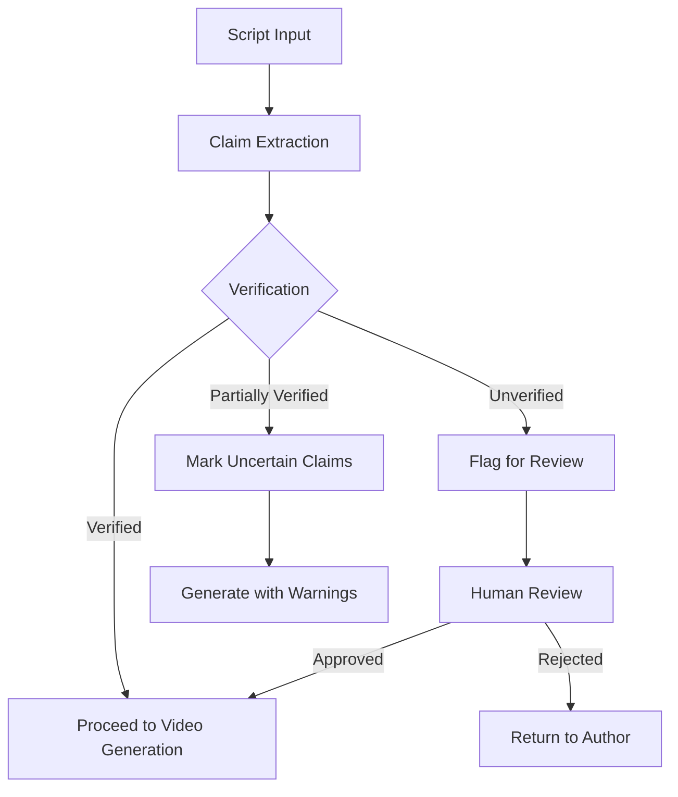

# PIB-VideoGen Fact-Checking Data Sources

## Overview

This document outlines the data sources and API endpoints used by the PIB-VideoGen fact-checking module. The fact-checking system is designed to verify claims in video scripts against trusted government sources before video generation proceeds.

## Internal Data Sources

### PIB Database

| Database | Description | Access Method | Update Frequency |
|----------|-------------|---------------|------------------|
| PIB Press Releases | Archive of all official press releases | Direct SQL connection | Real-time |
| Ministry Statements | Official statements from all ministries | REST API | Hourly |
| Government Bulletins | Regular bulletins and updates | GraphQL API | Daily |
| Policy Documents | Official policy documents and guidelines | Document API | Weekly |

### Connection Details

```yaml
# Connection configuration (template)
pib_database:
  host: pib-data-cluster.internal
  port: 5432
  database: press_releases
  schema: public
  ssl: true
  connection_timeout: 30s
  connection_pool: 10
  read_only: true
```

## External API Endpoints

### Government APIs

| API Name | Purpose | Endpoint | Authentication | Rate Limits |
|----------|---------|----------|----------------|-------------|
| National Disaster Management API | Verify emergency alerts and disaster information | `https://api.ndma.gov.in/v1/alerts` | API Key + JWT | 100 req/min |
| Open Government Data Platform | Verify statistics and demographic data | `https://data.gov.in/api/v2/resource` | OAuth 2.0 | 1000 req/day |
| Ministry of Finance Data Service | Verify financial and economic data | `https://api.finmin.gov.in/data` | API Key | 50 req/min |
| Election Commission API | Verify election-related information | `https://api.eci.gov.in/v1` | Certificate-based | 30 req/min |
| Weather Information Service | Verify weather-related claims | `https://api.weather.gov.in/forecast` | API Key | 500 req/hour |

### Trusted News Sources

| Source | Content Type | API Endpoint | Update Frequency |
|--------|--------------|--------------|------------------|
| Doordarshan News | National news | `https://api.dd.gov.in/news` | 15 minutes |
| All India Radio | Audio news and transcripts | `https://api.air.gov.in/bulletins` | 30 minutes |
| Prasar Bharati | Official broadcasts | `https://api.prasarbharati.gov.in` | Hourly |

## Claim Extraction and Verification Process

1. **Claim Extraction**:
   - Text is processed using NER (Named Entity Recognition) to identify entities
   - Dependency parsing identifies relationships between entities
   - Pattern matching extracts numerical claims, dates, locations, and statistics

2. **Source Selection**:
   - Claims are categorized by type (financial, disaster, policy, etc.)
   - Appropriate data sources are selected based on claim category
   - Multiple sources are queried for cross-verification

3. **Verification Logic**:
   - Exact match: Direct comparison with source data
   - Semantic match: Embedding-based similarity for conceptual verification
   - Temporal validation: Checking if claims are current and not outdated
   - Numerical tolerance: Allowing small variations in numerical data (±5%)

## Caching and Performance

| Cache Type | Purpose | TTL | Invalidation Trigger |
|------------|---------|-----|----------------------|
| Redis Primary | Frequently accessed facts | 24 hours | New press release |
| Local Memory | Ultra-high frequency lookups | 1 hour | Service restart |
| Disk Cache | Large datasets | 7 days | Manual refresh |

## Fallback Mechanism

When primary sources are unavailable:

1. Check cached data with clear timestamp indication
2. Query secondary government sources
3. Flag content for human review if verification is incomplete
4. In emergency mode, proceed with generation but add "Information being verified" watermark

## Logging and Audit

All fact-checking operations are logged with:

- Timestamp
- Claim text
- Sources queried
- Verification result
- Confidence score
- Time taken for verification

Logs are stored in a tamper-evident database for quarterly audits and compliance reviews.

## Integration with Video Generation Pipeline



## Maintenance and Updates

- **API Endpoint Monitoring**: Continuous health checks every 5 minutes
- **Source Addition Process**: New sources require approval from Editorial Board
- **Quarterly Source Review**: All sources are reviewed for reliability and accuracy
- **Version Control**: All changes to verification logic and source configurations are version-controlled

## Responsible Use Guidelines

1. Fact-checking results should never be modified or overridden without proper authorization
2. Emergency mode bypasses should be logged and reviewed within 24 hours
3. Any systematic verification failures should trigger an immediate review of the source
4. Confidence thresholds should be adjusted based on content sensitivity

---

*Last Updated: June 2023*
*Document Owner: PIB-VideoGen Governance Committee*