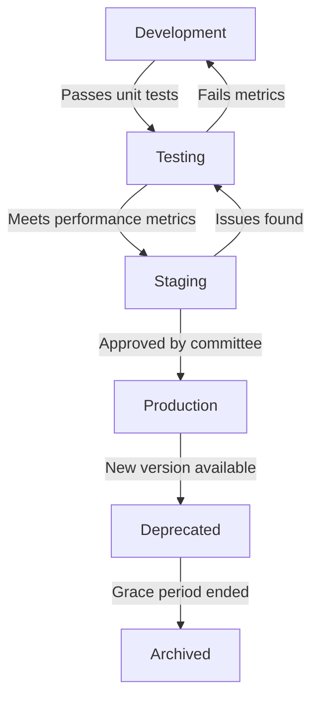

# PIB-VideoGen Model Version Control System

## Overview

This document outlines the version control system for models and parameters used in the PIB-VideoGen system. Proper versioning is critical for reproducibility, governance, and maintaining a clear audit trail of model changes and performance.

## Model Versioning Structure

### Naming Convention

All models follow this naming convention:

```
pib-vg-{component}-{architecture}-{version}-{date}
```

Where:
- `component`: The specific component (base, residual, super-res, fact-check)
- `architecture`: The model architecture (diffusion, transformer, etc.)
- `version`: Semantic versioning (MAJOR.MINOR.PATCH)
- `date`: Release date in YYYYMMDD format

Example: `pib-vg-base-diffusion-1.2.3-20230615`

### Directory Structure

```
models/
├── base/
│   ├── v1.0.0/
│   │   ├── model.pt
│   │   ├── config.yaml
│   │   ├── metadata.json
│   │   └── performance.json
│   └── v1.1.0/
│       ├── model.pt
│       ├── config.yaml
│       ├── metadata.json
│       └── performance.json
├── residual/
│   ├── v1.0.0/
│   └── v1.1.0/
├── super_resolution/
│   ├── v1.0.0/
│   └── v1.1.0/
└── fact_checking/
    ├── v1.0.0/
    └── v1.1.0/
```

## Parameter Tracking

### λ Parameter Management

The λ parameters (base_noise_lambda and residual_noise_lambda) are critical for video quality and are tracked with special attention:

```json
{
  "parameter_id": "lambda-20230615-1",
  "base_noise_lambda": 0.7,
  "residual_noise_lambda": 0.3,
  "effective_date": "2023-06-15",
  "approved_by": "Model Governance Committee",
  "performance_metrics": {
    "fvd": 185.3,
    "is": 72.6,
    "temporal_coherence": 0.93
  },
  "tested_scenarios": ["policy_briefing", "emergency_alert", "instructional"],
  "notes": "Optimized for better temporal consistency in rapid motion scenes"
}
```

### Parameter Version History

All parameter changes are recorded in a version-controlled JSON file:

```
config/
└── parameters/
    ├── lambda_parameters.json
    ├── training_parameters.json
    └── inference_parameters.json
```

## Git-Based Version Control

### Branching Strategy

```
main
├── develop
│   ├── feature/base-model-improvement
│   ├── feature/residual-noise-optimization
│   └── feature/fact-check-enhancement
└── release/v1.1.0
    └── hotfix/emergency-mode-fix
```

### Commit Message Convention

Commit messages follow this format:

```
[COMPONENT] TYPE: Description

Detailed explanation

Performance impact: +/-X% on metric Y
Reviewed-by: Name
```

Where:
- `COMPONENT`: base, residual, super-res, fact-check, etc.
- `TYPE`: train, tune, fix, optimize, etc.

Example:
```
[BASE] TUNE: Adjust attention mechanism for better temporal coherence

Modified cross-frame attention to improve consistency between frames
with high motion content. Tested on 50 sample videos.

Performance impact: -15% on FVD, +2% on temporal coherence
Reviewed-by: Dr. Sharma
```

## Model Metadata

Each model version includes a metadata.json file with:

```json
{
  "model_id": "pib-vg-base-diffusion-1.2.3-20230615",
  "description": "Base noise generator with improved temporal consistency",
  "architecture": {
    "type": "diffusion",
    "layers": 24,
    "attention_heads": 16,
    "parameters": 1.2e9
  },
  "training": {
    "dataset": "pib-video-corpus-2023Q2",
    "samples": 50000,
    "epochs": 100,
    "batch_size": 32,
    "optimizer": "AdamW",
    "learning_rate": 1e-5,
    "training_time": "120 hours",
    "hardware": "8x A100 GPUs"
  },
  "performance": {
    "fvd": 185.3,
    "is": 72.6,
    "temporal_coherence": 0.93,
    "generation_time": "2.3 seconds per frame"
  },
  "dependencies": {
    "pytorch": "2.0.1",
    "diffusers": "0.16.1",
    "transformers": "4.29.2"
  },
  "authors": ["AI Team", "Video Quality Team"],
  "approval": {
    "approved_by": "Model Governance Committee",
    "approval_date": "2023-06-10",
    "production_date": "2023-06-15"
  },
  "changelog": [
    "Improved temporal consistency in high-motion scenes",
    "Reduced flickering artifacts by 30%",
    "Optimized memory usage during inference"
  ]
}
```

## Model Registry

A central model registry tracks all models and their status:

```
models/
└── registry/
    ├── model_registry.db
    └── registry_api.py
```

The registry maintains these model statuses:

1. `development`: Under active development, not for production
2. `testing`: Completed development, undergoing evaluation
3. `staging`: Approved for limited production use
4. `production`: Fully approved for production use
5. `deprecated`: No longer recommended for use
6. `archived`: Removed from active service

## Deployment Workflow



## Rollback Procedure

In case of critical issues with a deployed model:

1. Immediately tag the problematic model as `critical-issue`
2. Activate the previous stable version from the registry
3. Move traffic gradually to the previous version (20% increments)
4. Monitor performance metrics during rollback
5. Document the issue and rollback in the incident log
6. Conduct root cause analysis within 24 hours

## Audit and Compliance

### Quarterly Audit Process

1. Review all model versions deployed during the quarter
2. Analyze performance metrics across different use cases
3. Verify that all model changes followed the approval process
4. Check for any unauthorized parameter modifications
5. Generate compliance report for governance committee

### Audit Artifacts

```
docs/
└── audits/
    ├── 2023Q1/
    │   ├── model_audit_report.pdf
    │   ├── parameter_changes.json
    │   └── compliance_checklist.md
    └── 2023Q2/
        ├── model_audit_report.pdf
        ├── parameter_changes.json
        └── compliance_checklist.md
```

## Continuous Integration

All model changes trigger an automated pipeline:

1. Build and test the model with unit tests
2. Run performance benchmarks on standard test set
3. Generate performance comparison with previous version
4. Create model cards with key metrics
5. Update the model registry with new version

## Emergency Procedures

For urgent fixes (e.g., security vulnerabilities, critical bugs):

1. Create a hotfix branch from production
2. Implement and test the fix
3. Expedited review by at least two senior team members
4. Deploy with emergency tag and heightened monitoring
5. Backport the fix to development branch

## Responsible AI Considerations

Each model version includes an assessment of:

1. Bias metrics on diverse test sets
2. Fairness across different languages and cultural contexts
3. Robustness to adversarial inputs
4. Compliance with PIB ethical guidelines

---

*Last Updated: June 2023*  
*Document Owner: PIB-VideoGen Model Governance Team*